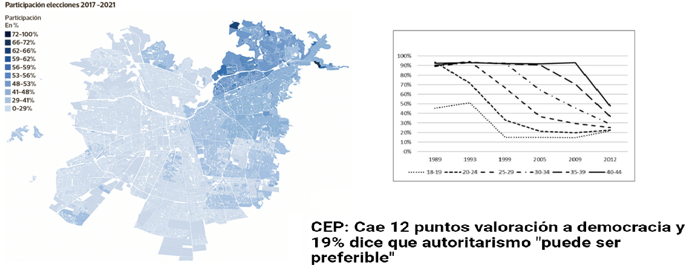
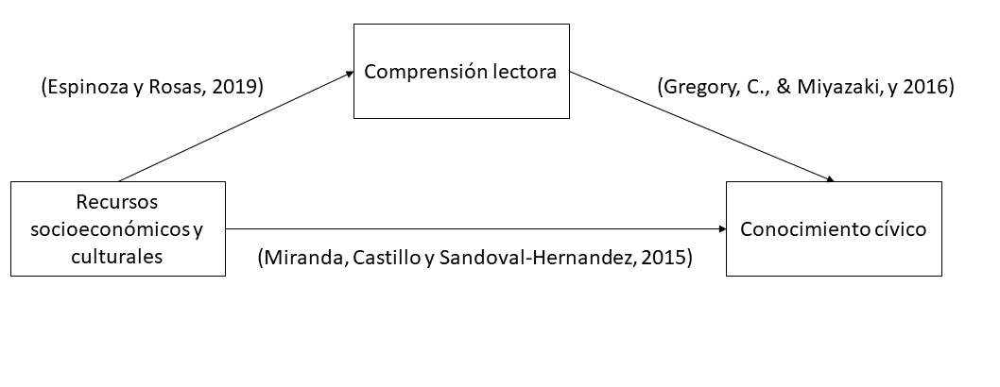
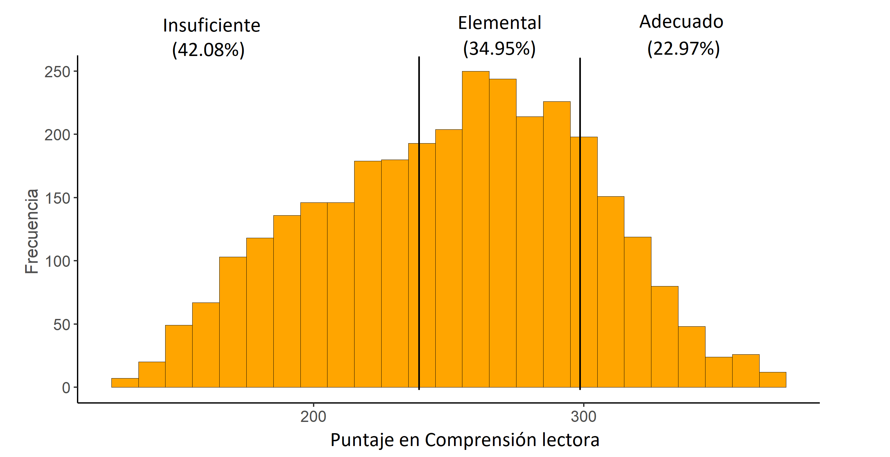
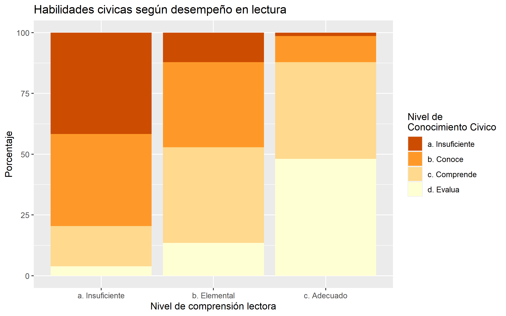

class: inverse, bottom, right

```{r setup, include=FALSE, cache = FALSE}
require("knitr")
options(htmltools.dir.version = FALSE)
pacman::p_load(RefManageR)
```

```{r eval=FALSE, echo=FALSE}
# Correr esta linea para ejecutar
rmarkdown::render('xaringan::moon_reader')
```

<!---
About macros.js: permite escalar las imágenes como [:scale 50%](path to image), hay si que grabar ese archivo js en el directorio.
.pull-left[<images/Conocimiento cívico.png>] 
.pull-right[<images/Conocimiento cívico_graf.png>]
layout: true
class: animated, fadeIn
--->

# __El lenguaje como brecha de la formación ciudadana:__
# El rol de la comprensión lectora sobre las habilidades para la ciudadanía y el conocimiento cívico 
<br>
<hr>
### Francisco Meneses Rivas, *Universidad de Chile*


.small[Fondecyt n°1181239 “Socialización política y experiencia escolar: el rol de la familia y la escuela”]
.small[Fondecyt n°XXXXXXX "Meritocracia en la escuela (EDUMER): Fundamentos morales del mercado educativo y sus implicancias para la formación ciudadana en Chile"]

---

class: inverse, middle, center, slideInRight
 
# Introducción


---

# Democracia en problemas

> Disminución de la participación

> Desigualdad en la participación

> Dudas sobre la democracia


.under[]


???


---

# Educación cívica y conocimiento cívico

.pull-left[

* La apuesta: Plan de formación ciudadana

> "formar a los estudiantes para el ejercicio de una ciudadanía crítica, responsable y respetuosa" ([Mineduc, 2023](https://formacionciudadana.mineduc.cl/))
.center[]

]

.pull-right[
  
   * Conocimiento cívico: Habilidades y conocimientos para la vida cívica y ciudadana [(Schulz et al. 2011)]()
   * Fomenta actitudes y prácticas democráticas 
        + Tolerancia [(Caro & Schulz 2012)]()
        + Participación [(Miranda, Castillo & Sandoval-Hernandez 2015)]()
        + Valoración de la democracia [(Schulz, 2010)]()
      ]


???

nace la necesidad de estudiarlo

---

# ¿Qué afecta al conocimiento cívico? Teoría de la socialización

* Prácticas democráticas en la escuela [(Treviño, Béjares, Villalobos & Naranjo, 2016)](https://doi.org/10.1080/00220671.2016.1164114)

  * Apertura a la discusión en el aula

* Modelo de recursos [(Castillo, Miranda, Bonhomme, Cox & Bascopé, 2014)](https://doi.org/10.1177/1746197914520650)

> ¿Por qué la desigualdad social repercute en el conocimiento cívico?

---

## El efecto de los recursos culturales y la alfabetización  

* Existen efectos del NSE unidimensional 

* Destacan el efecto de lo cultural académico educación y libros (Castillo)

* Libros en el hogar y conocimiento cívico  [(Gregory & Miyazaki, 2016)](10.1080/00220671.2016.1255869)
    
    + Puntaje de alfabetización del hogar
    + Libros en el hogar y rendimiento académico [(Evans, Kelley & Sikora, 2014)](10.1093/sf/sou030)
    + Entornos de alfabetización y comprension lectora [(Park, 2008)](https://doi.org/10.1080/13803610802576734)
    
* Evaluó el efecto del entorno de la alfabetización, pero no de la alfabetización misma (Oportunidad)
    

---

class: inverse, middle, center, slideInRight
 
# ¿Influyen las habilidades sobre comprensión lectora en el conocimiento cívico de los estudiantes?


---

## Desigualdad social, ciudadanía y lenguaje

* Clases sociales y lenguaje [(Bernstein, 1985)](https://doi.org/10.17227/01203916.5117.)

* Desigualdad en las habilidades del lenguaje en Chile [(Espinoza & Rosas, 2019)](https://www.scielo.cl/scielo.php?pid=S0718-97292019000300023&script=sci_arttext)





---

class: inverse, middle, center, slideInRight
 
# ¿Puede la comprensión lectora explicar la relación entre nivel socieconómico y conocimiento cívico?

### ¿Y es capaz de moderar esta relación?


---

# Hipótesis
    
  1. La comprensión lectora se asocia con el c. cívico
  
  2. La comprensión lectora media la relación entre NSE y cívico
    
  3. La comprensión lectora modera el efecto entre NSE y cívico

---

class: inverse, middle, center, slideInRight

# Metodología

---

# Metodología  

* Perspectiva cuantitativa 

* Base de datos ICCS-SIMCE (Estudiantes: 3140, Escuelas: 152)

* Regresiones multinivel

* Mediaciones e interacciones

* Variables centrales

* Controles

    + Sexo
    + Características democráticas de la escuela
    + Interés político de padres y estudiantes

???

Para dimensionar cuánto de la relación se explica

Estudiantes de 8vo

Para trabajar con muestras jerarquizadas de colegios

Explicar que a más puntaje de iccs denota manejo de habilidades más complejas.

---


.under[]


---

class: inverse, middle, center, slideInRight

# Resultados: Relación, Mediación e Interacción

---

# Distribución del conocimiento cívico

.center[]


---

# Distribución de la comprensión lectora

.center[]


---

# Asociación comprensión lectora conocimiento cívico

.pull-left[

.center[]

]

.pull-right[

.center[]

]
---

.center[]


---

# Mediación: Libros en el hogar


.center[]

---


# Mediación: Ocupación de los padres


.center[]


---


# Mediación: Educación de los padres


.center[]

---


# Moderando la desigualdad 

.center[]


---

# En síntesis 

* Existe desigualdad en el conocimiento cívico

* Esta se asocia a la desigualdad de recursos de los padres, especialmente con los culturales

* El lenguaje de los estudiantes afecta su capacidad de incorporar el conocimiento cívico

* El lenguaje explica parcialmente la desigualdad en el conocimiento cívico y es capaz de moderarla

* Este modelo es muy adecuado para explicar diferencias individuales

---

# El eslabón perdido de la reproducción intergeneracional de la desigualdad política: el lenguaje

* Esta investigación ayuda a profundizar la comprensión de la reproducción social de la desigualdad política, como [Brady et al. (2015)]() sugería necesario

* Entrega evidencia a favor de las propuestas de [Gregory & Miyazaki (2016)](10.1080/00220671.2016.1255869), pues efectivamente un ambiente con alta alfabetización fomenta habilidades cognitivas que facilitan aprender el conocimiento cívico 

* Permite redimensionar el efecto de la desigualdad, pues, no es tanto el efecto del estatus sino de las habilidades

---

# Aporte a la política pública


* Destaca la importancia de fomentar habilidades básicas para la correcta incorporación del contenido de formación ciudadana 

* ¿Contenido transversal o ramo particular? Lo relevante es practicar la interpretación de situaciones políticas. 

* El riesgo de fomentar la educación cívica en un país con educación desigual 

* Ha sido una buena apuesta el foco en lectura luego de la pandemia


---

class: inverse, middle, center, slideInRight

# Defendiendo la tesis...

---


# Sobre introducción y antecedentes

* Lenguaje → política [(Gregory & Miyazaki, 2016)](10.1080/00220671.2016.1255869)

* Relación libros en el hogar → lenguaje [(Evans, Kelley & Sikora, 2014)](10.1093/sf/sou030)

* Argumentación de la mediación


---

# Metodología


* La casi mediación...


* ¿Y la interacción?


* Consecuencias de dicotomizar y "el factor de nse"

---

# Conclusiones


* Retomar el modelo 

* Destacar las implicancias 