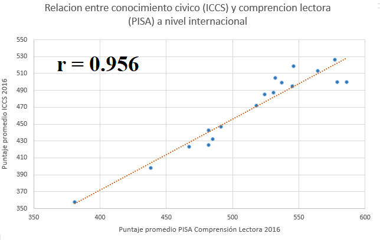

class: inverse, bottom, right

```{r setup, include=FALSE, cache = FALSE}
require("knitr")
options(htmltools.dir.version = FALSE)
pacman::p_load(RefManageR)
```

```{r eval=FALSE, echo=FALSE}
# Correr esta linea para ejecutar
rmarkdown::render('xaringan::moon_reader')
```

<!---
About macros.js: permite escalar las imágenes como [:scale 50%](path to image), hay si que grabar ese archivo js en el directorio.
.pull-left[<images/Conocimiento cívico.png>] 
.pull-right[<images/Conocimiento cívico_graf.png>]

--->

# __EL PODER DE LAS PALABRAS__
#El efecto del manejo del lenguaje en la transmicion intergeneracional de las habilidades politicas en jovenes chilenos. 
## *Problemas, soluciones y proyecciones" *
<br>
<hr>
### Francisco Meneses Rivas, *Universidad de Chile*

<br>

.small[Profesor guia: Juan Carlos Castillo]

---

layout: true
class: animated, fadeIn

---
class: inverse, middle, center, slideInRight

# En capitulos anteriores...
---
## Problema Teorico: "El error de medida"
.center[]

### Las pruebas son validas.
  * IEA ICCS 
  * MINEDUC SIMCE

---

## Solución: La relacion ontologica entre lenguaje y pensamiento.
 
 * Logos y Aristoteles
 * Herder
 * heidegger y Wittgenstein
 * Berstein
 * ademas... medicion
 
.under[]
---
## Problema Metodológico: ¿y la independencia de casos?
.center[]

---

## Mediación multinivel (Zhang, Zyphur y Preacher, 2008).
.center[]

---
# Falta: 

* Hacer mediación con controles. 

* Editar el texto (La redacción esta confusa)
---

class: inverse, middle, center, slideInRight
¡Gracias!