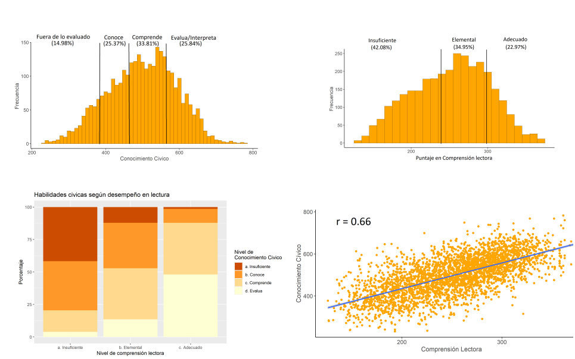

class: inverse, bottom, right

```{r setup, include=FALSE, cache = FALSE}
require("knitr")
options(htmltools.dir.version = FALSE)
pacman::p_load(RefManageR)
```

```{r eval=FALSE, echo=FALSE}
# Correr esta linea para ejecutar
rmarkdown::render('xaringan::moon_reader')
```

<!---
About macros.js: permite escalar las imágenes como [:scale 50%](path to image), hay si que grabar ese archivo js en el directorio.
.pull-left[<images/Conocimiento cívico.png>] 
.pull-right[<images/Conocimiento cívico_graf.png>]

layout: true
class: animated, fadeIn
--->

# __LENGUAJE PARA LA CIUDADANIA__
# el manejo del lenguaje como explicación a la desigualdad social del conocimiento civico. 
<br>
<hr>
### Francisco Meneses Rivas, *Universidad de Chile*

<br>

.small[Profesor guía: Juan Carlos Castillo]

---
class: inverse, middle, center, slideInRight
 
# Introducción


---


## El conocimiento civico y su importancia

 * Desigualdad politica y educación civica.
 
 * Conocimiento civico: contenido y habilidades
 
 * Sociologia y socialización 
 
 
.center[]

???
En Chile frente la baja y desigual participación ciudadana, se ha promovido desde el ámbito educativo la importancia del conocimiento cívico y la educación ciudadana.  Esto con el objetivo de propiciar en los jóvenes una ciudadanía comprometida y con más herramientas para la democracia.

El conocimiento cívico se define como los conocimientos y habilidades necesarias para llevar la vida democrática . Por ejemplo, es necesario saber cuáles son los derechos propios de los ciudadanos, así como hay que tener habilidades para utilizar este conocimiento en situaciones concretas. 

Desde la investigación sociológica , se ha evidenciado que los conocimientos cívicos, se distribuyen desigualmente en la sociedad influidos por la socialización escolar y familiar. En las familias, la evidencia señala una transmisión intergeneracional, según la cual estudiantes con padres de menores recursos poseen consistentemente un menor conocimiento cívico.No obstante, aun es tema de debate las razones por las que los recursos influyen sobre el conocimiento cívico. 

---
## Desigualdad en conocimiento civico y reproducción cultural

* Reproducción cultural: educacion y libros

* Libros en el estante 

* Dos hipotesis:
    - Indicador de socialización en temas politica
    - Indicador de socialización en habilidades del lenguaje
    
* El lenguaje como explicación a la reproducción cultural(Torney Purta, 2015)

### Pregunta de investigación

> ¿En que medida el manejo del lenguaje explica la influencia de los recursos culturales en el conocimiento civico de los estudiantes?

???

La teoría de la reproducción cultural ha ayudado a explicar la desigualdad del conocimiento cívico y ha llegado hipotetizar la importancia del lenguaje, aunque hasta ahora falta evidencia más adecuada para sostener esta hipótesis. La importancia de los factores culturales en la reproducción de la desigualdad del conocimiento cívico se sostiene en los efectos del nivel educativo de los padres y de la cantidad de libros en el hogar.   Cabe preguntarse ¿Cómo los libros en un estante pueden fomentar las habilidades para la ciudadanía?

Al explicar por qué los libros en el hogar mejoran el conocimiento cívico existen dos líneas. La primera supone los libros como un proxy de capital cultural el cual asocian a una socialización con más interés político. La segunda supone que los libros dan cuenta de una socialización cercana a la lectura y las habilidades del lenguaje. 

Para reforzar esta ultima propuesta  el presente estudio evalúa la capacidad del manejo del lenguaje para explicar la relación entre los recursos culturales de la familia y el conocimiento cívico de los estudiantes. 

---
class: inverse, middle, center, slideInRight
 
# Antecedentes


---


# Investigaciones sobre el conocimiento civico

* Conceptos similares
    + Conocimiento politico factual
    + Juicio politico

* Dominios del conocimiento civico
  
    + Contenido
    
    + Cognitivo
 
* Modelo de recursos (Miranda et al., 2015)[]

    + Actitudinal (Gimpel et al., 2003; Wasburn
and Adkins Covert, 2017)
    + Cognitiva  (Evans et al., 2015; Brady et al., 2015; Duarte et al., 2017; )[]
  

???

En los estudios con población adulta existen distintas formas de referirse al conocimiento cívico. Dos formas frecuentes son el conocimiento político factual, conceptualizado como el conocimiento de la contingencia política. Otra forma de conceptualizarlo es el juicio político, relativo a la coherencia de las reflexiones políticas. El conocimiento cívico, más utilizado en el contexto estudiantil, rescata aspectos de ambos conceptos anteriores. Por un lado, posee un dominio de contenido sobre sistemas y principios democráticos. Por otro lado posee un domino cognitivo que involucra habilidades como la interpretación o análisis basados en los conocimientos del dominio de contenido. 


El conocimiento civico esta muy influenciado por la socialización en la escuela y la familia. Respecto a la familia, el modelo de recursos es muy efectivo para explicar las diferencias en conocimiento civico.Mientras más recursos poseen los padres, mayor es el conocimiento civico de sus hijos.

Ahora bien, al explicar por que el modelo de recursos funciona existen dos hipotesis, la actitudinal, relativa a las practicas familiares y la cognitiva, relativa a las habilidades. Evans, a partir del efecto de los libros y otros autores coomo brady, sostienen que la trasmisión de habilidades academicas o de capital humano generan ventajas para el conocimiento civico. 

Por ello, es coherente proponer de un modo más concreto, que las habilidades sobre el lenguaje son trasmitidas y generan una ventaja sobre le conocimiento civico.

---
# Manejo del lenguaje y conocimiento civico

* Manejo del lenguaje y comprensión lectora

* Reprocución cultural y lenguaje [(Bernstein, 1985)]()

* Desigualdad en la comprensión lectora 

* Dificultades linguisticas frente a la prueba de ciudadania.[(Torney-Purta, 2015)]()


???

Por manejo del lenguaje entenderemos para esta tesis las habilidades que se poseen para comunicarse eficazmente. Una forma operacional de medir las habilidades de lenguaje es la comprensión lectora, la cual involucra distintas habilidades de distinta complejidad cognitiva, como la comprensión, el análisis y la interpretación.

La teoría de la reproducción cultural, y en particular Bernstein han señalado que el manejo del lenguaje se encuentra estratificado socialmente. Esto implica que personas con más recursos poseen un uso más amplio del lenguaje que les permite relacionarse con temas más abstractos como la política. Mientras que los sectores populares poseen tendencialmente un manejo del lenguaje más reducido a sus vivencias concretas. Por ello, hace sentido señalar que el manejo del lenguaje estratifica las posibilidades de adquirir el conocimiento cívico, primero porque el lenguaje elaborado facilita la comprensión de temas abstractos y, segundo, porque le lenguaje se encuentran del mismo modo estratificado socialmente

Actualmente la evidencia sobre la desigualdad en la educación entrega información consistente con la desigualdad propuesta por Bernstein. Como plantea Barahona hoy existen determinantes sociales que afectan la comprensión lectora de los estudiantes de estratos bajos 

Finalmente señalar que existe evidencia de las dificultades lingüísticas que enfrentan los estudiantes al responder la prueba de conocimiento civico.


---

.center[]

> Objetivo: Evaluar en que medida la comprensión lectora explica la desigualdad social en el conocimiento civico.


  + Evaluar la relación entre comprensión lectora y conocimiento civico
  + Evaluar la capacidad mediadora de la comprensión lectora entre los recursos familiares y el conocimiento cívico
  + Evaluar la capacidad del lenguaje para moderar la relación entre los recursos y el conocimiento cívico


???

En funcion de lo anterior, es razonable suponer que las variables de recursos explican el conocimiento civico mediante la transmisión de habilidades cognitivas como el manejo del lenguaje.

Por ello los objetivos de este trabajo son los siguientes.
---
class: inverse, middle, center, slideInRight

# Metodología
---

# Metodología.  

* Perspectiva cuantitativa 

* base de datos ICCS-SIMCE (Estudiantes: 3140, Escuelas: 152)

* Regresiones multinivel

???

para dimensionar cuanto de la relación se explica

Estudiantes de 8vo

para trabajar con muestras jerarquizadas de colegios

Explicar que a mas puntaje de iccs denota manejo de habilidades más complejas.
---


.center[]

---

class: inverse, middle, center, slideInRight

# Resultados: Relación, Mediación e Interacción.

---

.under[]


???


La mayoria de los estudiantes logra manejar dos habilidades del conocimiento civico, conocen y/o  comprenden, aunque no son capaces de interpretar ni de evaluar.

Respecto al manejo del lenguaje, En general los estudiantes poseen un nivel insuficiente de comprension lectora


Al asociar estas categorias de desempeño se observa la dramatica relacíón

Entre quienes tienen un nivel insuficiente de habilidades  lectura,  más del 75% solo conoce temas civicos pero nnoi llega a comprenderlos ni a interpretarlos ni a evaluarlos. TITULARRRE 
r)

Por contraparte entre quienes tienen un nivel adecuado de lectura, más del 80% de los estudiantes es capas de evaluar temas civicos o por lo menos comprenderlos.

Además podemos apreciar la relación en una nuve de puntos, con coeficiente de correlación de fuerte intencidad desde los parametros de cohen.

---

.center[]

???

Modelo nulo


Modelo de socialización familiar

  + El modelo de recursos Explica el 72% de la varianza entre escuelas
  

Modelo de socialización escolar

Modelo con interes politico 

Modelo con lenguaje.

  +  Tiene un efecto positivo y significativo

  + Este es el primer modelo que logra disminuir considerablemente la varianza a nivel 1. 
  
  + Controla el efecto de recursos culturales [TITULAR!]
  

Modelo con interacción

--- 

# Conclusiones, discusiones y aprendizajes. 

Esta investigación ayuda a profundizar la comprensión de la reproducción social de la desigualdad política, como Brady et al. (2015)

Mejorar la comprensión lectora como objetivo democratizador 

Apoyo en CL, a estudiantes y colegios con bajo rendimiento, para mejorar la recepción del curso de Educación cívica.

---

layout: true
class: animated, fadeIn

---

class: inverse, middle, center, slideInRight

# Conclusión

---

# El lenguaje: el eslabon de la reproducción cultural

* Existe desigualdad en el conocimiento civico

* Esta se asocia a la desigualdad de recursos de los padres

* Destacan los recursos culturales

* Desarrollo de habilidades cognitivas

* Este modelo es muy adecuado para explicar diferencias individuales.
