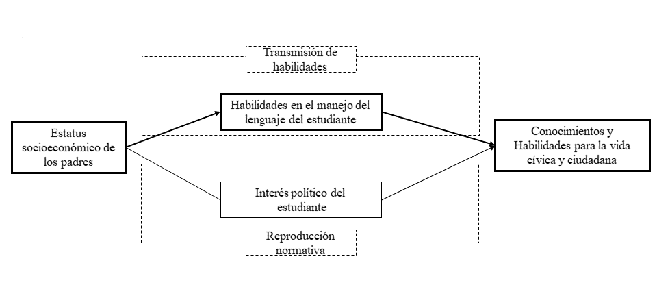
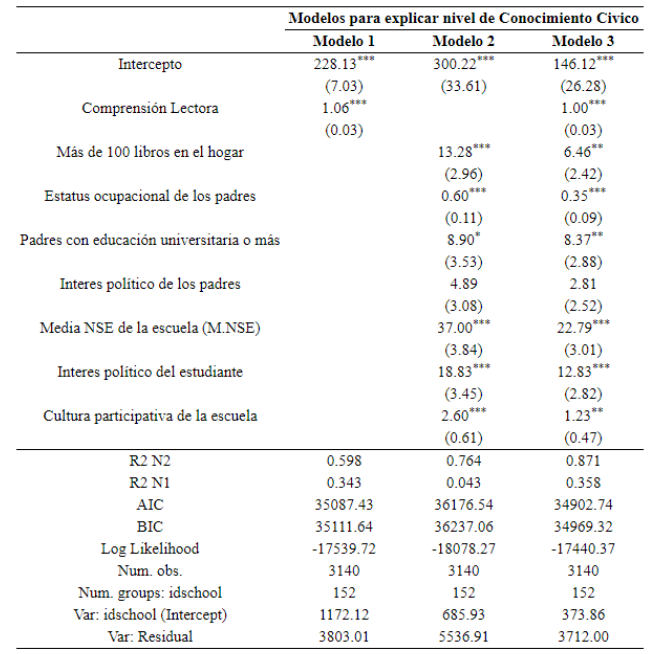
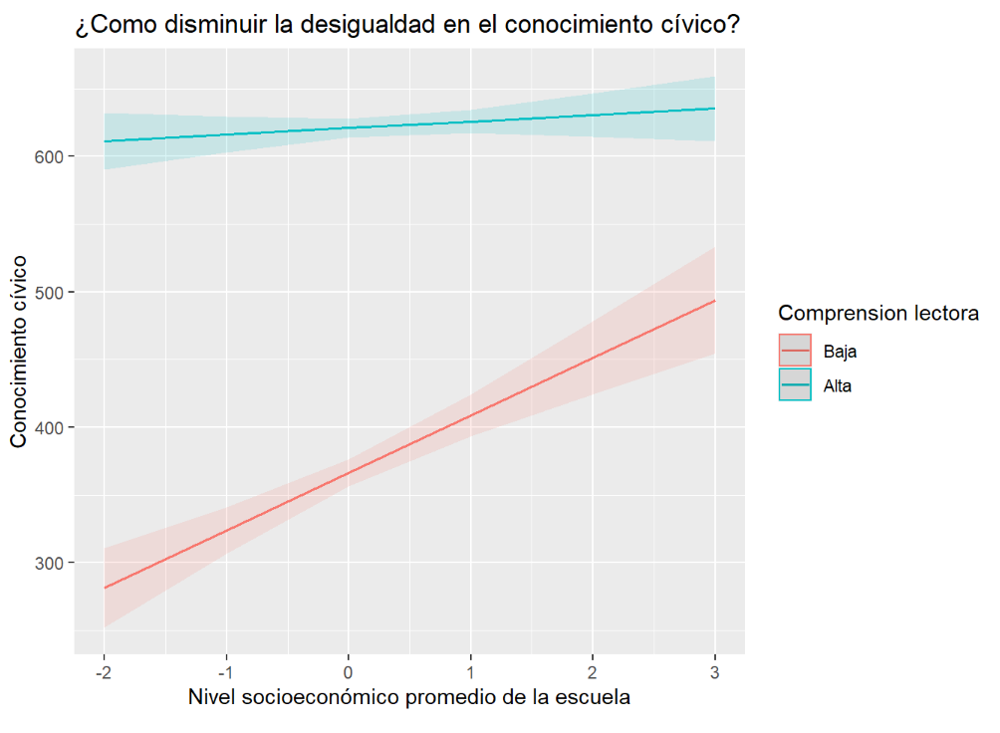

class: inverse, bottom, right

```{r setup, include=FALSE, cache = FALSE}
require("knitr")
options(htmltools.dir.version = FALSE)
pacman::p_load(RefManageR)
```

```{r eval=FALSE, echo=FALSE}
# Correr esta linea para ejecutar
rmarkdown::render('xaringan::moon_reader')
```

<!---
About macros.js: permite escalar las imágenes como [:scale 50%](path to image), hay si que grabar ese archivo js en el directorio.
.pull-left[<images/Conocimiento cívico.png>] 
.pull-right[<images/Conocimiento cívico_graf.png>]

--->

# __EL PODER DE LAS PALABRAS__
#El efecto del manejo del lenguaje en la transmicion intergeneracional de las habilidades politicas en jovenes chilenos. 
## *Problemas, soluciones y proyecciones" *
<br>
<hr>
### Francisco Meneses Rivas, *Universidad de Chile*

<br>

.small[Profesor guia: Juan Carlos Castillo]

---

layout: true
class: animated, fadeIn

---
class: inverse, middle, center, slideInRight

# ¿Qué busco estudiar?...
---
## Desigualdad en la voz politica

.center[]


### Con distintas expresiones
  * Desigualdad en participacion institucional y no institucional (ELSOC)
  * Problemas de representación en politicas del Estado, siendo un nodo de la desigualdad (PNUD)

---

## Desigualdad politica en practicas, actitudes y habilidades..
 
 * Diferencias en participacion y actitudes.
 
 * Estudios de socialización politica: La familia y la escuela como espacio de reproducción. 
 
 * La educacion civica como alternativa a la reproducción y la apatia poltica.
 
       * Diferencias en Habilidades y Conocimientos: El concepto de __conocimiento y habilidades para la vida ciudadana__ 

 
.center[]

---

## ¿Cómo podemos Explicar la desigualdad en las Habilidades politicas? 
 
 * Transferencia en valores politicos: La charla de sobremesa 
 
 * Transmición de recursos y habilidades: capcacidades cognitivas
 
 * Mi propuesta: La trasnmicion de habilidades es una mejor explicacion para la desigualdad. 
 
 * Más particularmente, __la habilidade de comprensión lectora es fundamnetal para las habilidades politicas__

.under[]

---
### Preguntas de Investigación
  
.center[]

  + ¿Existe relación entre comprensión lectora y habilidades politicas? 
  + ¿Es la comprensión lectora más capas de explicar la desigualdad del conocimiento civico que el interes politico? 
  + ¿Como podemos disminuir la desigualdad? 

---
class: inverse, middle, center, slideInRight

# ¿Como voy a estudiarlo?...
---

# Metodología.  

* perspectiva cuantitativa

* base de datos ICCS-SIMCE

* Mediación: X -> M -> Y 

* Multinivel: para trabajar con muestras completas de colegios

---

class: inverse, middle, center, slideInRight

# Resultados: Relación, Mediacón e Interacción.

---
# Existe efectivamente una relación entre comprension lectora y habilidades politicas

 * En correlato con la teoria, existe una coincidencia empirica 
 
.under[]

---

#  Manejo del lenguaje explica más que interes politico

.center[]

---

.center[]

--- 
# Concluciones, discuciónes y aprendisajes. 

Esta investigación ayuda a profundizar la comprensión de la reproducción social de la desigualdad politica, como Brady et al. (2015)

Mejorar la comprensión lectora como objetivo democratizador 

Apoyo en CL, a estudiantes y colegios con bajo rendimiento, para mejorar la recepcion del curso de Educación civica.

---

layout: true
class: animated, fadeIn

---

class: inverse, middle, center, slideInRight

# “Mi visión de la alfabetización va más allá del ba, be, bi, bo, bu; porque implica una comprensión crítica de la realidad social, política y económica en la que vive el alfabetizado” (Paulo Freire, 1992)

---
