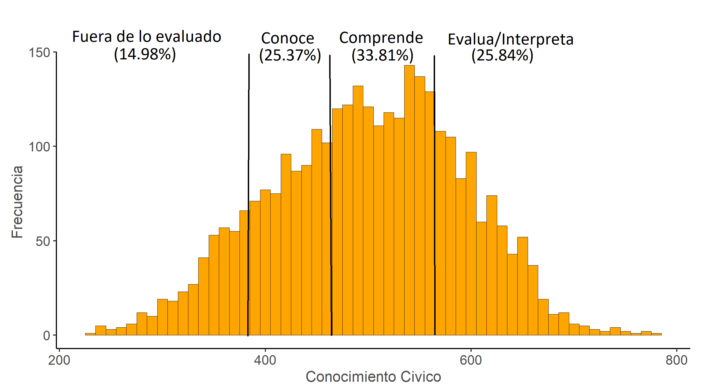

class: inverse, bottom, right

```{r setup, include=FALSE, cache = FALSE}
require("knitr")
options(htmltools.dir.version = FALSE)
pacman::p_load(RefManageR)
```

```{r eval=FALSE, echo=FALSE}
# Correr esta linea para ejecutar
rmarkdown::render('xaringan::moon_reader')
```

<!---
About macros.js: permite escalar las imágenes como [:scale 50%](path to image), hay si que grabar ese archivo js en el directorio.
.pull-left[<images/Conocimiento cívico.png>] 
.pull-right[<images/Conocimiento cívico_graf.png>]

layout: true
class: animated, fadeIn
--->

# __El lenguaje como brecha de la formación ciudadana:__
# El rol de la comprensión lectora sobre las habilidades para la ciudadanía y el conocimiento cívico.. 
<br>
<hr>
### Francisco Meneses Rivas, *Universidad de Chile*

<br>

.small[Fondecyt n°1181239 “Socialización política y experiencia escolar: el rol de la familia y la escuela”]
.small["Meritocracia en la escuela (EDUMER): Fundamentos morales del mercado educativo y sus implicancias para la formación ciudadana en Chile"]
---
class: inverse, middle, center, slideInRight
 
# Introducción


---
# Democracia en problemas

> Disminución de la participación

> Desigualdad en la participación

> Dudas sobre la democracia


???


---

# Educación civica y conocimiento civico

.pull-left[

* La apuesta: Plan de formación ciudadana

> "formar a los estudiantes para el ejercicio de una ciudadanía crítica, responsable y respetuosa" ([Mineduc, 2023](https://formacionciudadana.mineduc.cl/))

.center[]

]

.pull-right[

   * Conocimiento civico: Habilidades y conocimientos para la vida civica y ciudadana (Schulz et al. 2011)
    
   * Fomenta actitudes democraticas 
   
        + Tolerancia (Caro and Schulz 2012)
        + Participación (Miranda, Castillo y Sandoval-Hernandez 2015)
        + 
]


???

nace la necesidad de estudiarlo
---

# ¿Que afecta al conocimiento civico? Teoria de la socialización

* Prácticas democráticas en la escuela [(Treviño, Béjares, Villalobos & Naranjo, 2016)](https://doi.org/10.1080/00220671.2016.1164114)

  * Apertura a la discución en el aula

* Modelo de recursos[(Castillo, Miranda, Bonhomme, Cox & Bascopé 2014)](https://doi.org/10.1177/1746197914520650)

> ¿Por que la desigualdad social repercute en el conocimiento civico?

---

## El efecto de los recursos culturales y la alfabetización  

* Existen efectos del NSE unidimensional 

* Destacan el efecto de lo cultural académico educación y libros (Castillo)

* Libros en el hogar y conocimiento cívico  [(Gregory y Miyazaki, 2016)](10.1080/00220671.2016.1255869)
    
    + Puntaje de alfabetización en el hogar
    + Libros en el hogar y rendimiento académico [(Evans, Kelley, & Sikora, 2014)](10.1093/sf/sou030)
    + Entornos de alfabetización y comprension lectora [(Park ,2008)](https://doi.org/10.1080/13803610802576734)
    
* Evaluo el efecto del entorno de la alfabetización, pero no de la alfabetización misma (Oportunidad)
    

---

class: inverse, middle, center, slideInRight
 
# ¿Influyen capaces las habilidades sobre comprensión lectora en el conocimiento civico de los estudiantes?


---
## Desigualdad social, ciudadanía y Lenguaje

* Clases sociales y lenguaje [(Bernstein, 1985)](https://doi.org/10.17227/01203916.5117.)

* Desigualdad en las habilidades del lenguaje en Chile [(Espinoza y Rosas, 2019)](https://www.scielo.cl/scielo.php?pid=S0718-97292019000300023&script=sci_arttext)


---

class: inverse, middle, center, slideInRight
 
# ¿Puede la comprensión lectora explicar la relación entre nivel socieconómico y conocimiento cívico?

### ¿Y es capas de moderar esta relación?


---

# Hipótesis
    
    1. La comprensión lectora se asocia con el c. cívico
    
    2. La comprensión lectora media la relación entre NSE y cívico
    
    3. La comprensión lectora modera el efecto entre NSE y cívico

---
class: inverse, middle, center, slideInRight

# Metodología
---

# Metodología.  

* Perspectiva cuantitativa 

* base de datos ICCS-SIMCE (Estudiantes: 3140, Escuelas: 152)

* Regresiones multinivel

* Mediaciones e interacciones

* Controles

    + Sexo
    + caracteristicas democraticas de la escuela
    + interes politico de padres y estudiantes

???

para dimensionar cuanto de la relación se explica

Estudiantes de 8vo

para trabajar con muestras jerarquizadas de colegios

Explicar que a mas puntaje de iccs denota manejo de habilidades más complejas.

---


.under[]


---

class: inverse, middle, center, slideInRight

# Resultados: Relación, Mediación e Interacción.

---

# Distribución del conocimiento civico

.center[]


---

# Distribución de la comprensión lectora

.center[]


---

# Asociación  comprensión lectora conocimiento civico

.pull-left[

.center[]

]

.pull-right[

.center[]

]
---

.center[]


---

# Mediación: Libros en el hogar


.center[]

---


# Mediación: Ocupación de los padres


.center[]


---


# Mediación: Educación de los padres


.center[]

---


# Moderando la desigualdad 

.center[]


---

# En sintesis 

* Existe desigualdad en el conocimiento cívico

* Esta se asocia a la desigualdad de recursos de los padres, especialmente con los culturales

* El lenguaje de los estudiantes afecta su capacidad de incorporar el conocimiento cívico

* El lenguaje explica parcialmente la desigualdad del conocimiento civico y es capas de moderarla

* Este modelo es muy adecuado para explicar diferencias individuales.

---
# El eslavon perdido de la reproducción intergeneracional de la desigualdad política: el lenguaje

* Esta investigación ayuda a profundizar la comprensión de la reproducción social de la desigualdad política, como [Brady et al. (2015)]() sugería necesario

* Entrega evidencia a favor de las propuestas de [(Gregory y Miyazaki, 2016)](10.1080/00220671.2016.1255869), pues efectivamente un ambiente con alta alfabetización fomenta habilidades cognitivas que facilitan aprender el conocimiento civico 

* Permite redimencionar el efecto de la desigualdad, pues, no es tanto el efecto del estatus sino de las habilidades

---

# Aporte a la politica publica


* Destaca la importancia de fomentar habilidades basicas para la correcta incorporación del curriculum de formación ciudadana 

* El riesgo de fomentar la educación civica en un pais con educación desigual 

* Ha sido una buena apuesta el foco en lectura de vuelta de la pandemia


---

class: inverse, middle, center, slideInRight

# Defendiendo la tesis...

---


# Sobre introducción y antecedentes

* lenguaje →política ([(Gregory y Miyazaki, 2016)](10.1080/00220671.2016.1255869))

* relación libros en el hogar → lenguaje [(Evans, Kelley, & Sikora, 2014)](10.1093/sf/sou030)

* Argumentación de la mediación


---

# Metodología


* La casi mediacion...


* ¿y la interacción?


* Consecuencias de dicotomizar y "el factor de nse"


---

# Formato

* Debere trabajar arduamente en esto y quiza pedir ayuda


