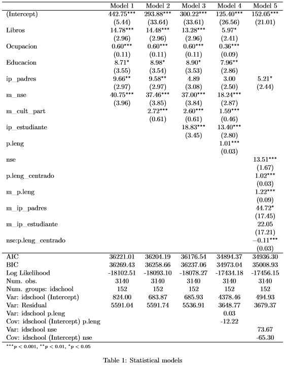

class: inverse, bottom, right


```{r setup, include=FALSE, cache = FALSE}
require("knitr")
library(xaringan)
library(texreg)
options(htmltools.dir.version = FALSE)
pacman::p_load(RefManageR)
```

```{r eval=FALSE, echo=FALSE}
# Correr esta linea para ejecutar
rmarkdown::render('pres_2_t2.Rmd', 'xaringan::moon_reader')

```

```{r include=FALSE}

load(file = "../output/images/results_1.Rdata")
load(file = "../output/images/results_2.Rdata")
load(file = "../output/images/results_3.Rdata")
load(file = "../output/images/results_4.Rdata")
load(file = "../output/images/results_5.Rdata")
load(file = "../output/images/results_7.Rdata")
load(file = "../output/images/results_8.Rdata")
```

<!---
About macros.js: permite escalar las imágenes como [:scale 50%](path to image), hay si que grabar ese archivo js en el directorio.
--->
# ¿Como resolver la reproduccion de la desigualdad politica?
## * La importancia del manejo del lenguaj para el conocimiento civico *
<br>
<hr>
### Francisco Meneses Rivas, Estudiante de Sociologia de la universidad de Chile.

<br>

.small[Seminario de grado - Profesor Guía: Juan Carlos Castillo]
---
#Problema social: La desigualdad politica


> En Chile, la desigualdad economica posee relacion con la desigualdad en la paritipacion politica lo cual pone en riesgo la legitimidad de la democracia. 
---

## Escuela de la reproduccion cultural 

  * Bourdieu y Berstein
    
    + Habilidades: incorporacion de pautas complejas de lenguaje (Bernstein, 1977)
  
    +  Gustos: influencia social sobre los intereses personales  (Bourdieu,1979)
  
## Investigaciones actuales

 * Estudio Internacional de Educación Cívica y Formación Ciudadana
    
    + Desigualdad social en el conocimiento civico (Schulz,2010)
    
    + Papel fundamental del capital cultural (Castillo, Miranda, Bonhomme, Cox & Bascopé, 2014)
   
    + Dificultad de los estudiantes para comprender los enunciados la prueba  (Zhang,Torney-Purta & Mislevy, 2015)

---

## Discutiendo los antecedentes del conocimiento civico
  
  1. Falta de claridad del papel que poseen los intereses y las habilidades
  
  2. Posible sobre-estimacion del efecto del nivel socioeconomico por ausencia de variables potencialmente importantes: 
    * la importancia del manejo del lenguaje.
    * la importancia de la capacidades analiticas.
    * la importancia de las capacididades de memeoria.
    
  3. Falta de propuestas de solución focalizadas para grupos vulnerables
  
### Nuestra propuesta:

__Se hipotetisa que el lenguaje posee un rol fundamental por las siguientes razones__

  * La comprension lectora requiere de las mismas habilidades que el conocimiento civico (Comprension, analisis, interpretacion y evaluacion)
  * Algunos estudiantes no son capaces de comprender las fraces de la prueba de conocimiento civico. 
  * _Zoon politikón__: Aristoteles y Harendt destacan el rol del lenguaje como escencia de la politica.  

---
<div style="text-align: justify">

## Preguntas e hipótesis de investigación:
  
  * Objetivo general: Comprender el rol que cumple la comprensión lectora en la influencia del origen socioeconómico sobre el conocimiento cívico.

* Objetivos específicos: 

    + Evaluar la relación entre comprensión lectora y conocimiento cívico incorporando factores influyentes señalados por la literatura.

    + Contrastar si la desigualdad social del conocimiento cívico se explica en mayor medida por las diferencias de comprensión lectoras o por la transmisión de interés políticos.

    + Evaluar la capacidad que posee la comprensión lectora para resolver la desigualdad social del conocimiento cívico.

<div/>
---
 # Método

  ## Variables 
    - Prueba internacional de conocimiento cívico (ISSC)
    - Prueba de comprensión lectora de lenguaje (SIMCE)
    - National index of socioeconomic background (ISSC)
  ## Estadisticos
    - path uni-nivel y multi-nivel(en progreso)
    - interacciones entre niveles de regresiones multinivel 

---

class: middle, center

# H1: La desigualdad socieconomica del conocimiento cívico es mediada en buena medida por el manejo del lenguaje. 

---
class: middle, center

# Resultados: Análisis multinivel

---

{width=90%}
---

class: middle, center

<div style="text-align: justify">

> __Resultados__: A partir de la regresión multinivel anterior podemos decir que prácticamente todo el efecto sobre conocimiento cívico de poseer libros en el hogar es controlado por las habilidades de comprensión lectora. Esto indica que el efecto de los libros en el hogar se debe a la translaticio de habilidades, más precisamente, al desarrollo de capacidades lingüísticas que permitan la comprensión, interpretación y evaluación del mundo político. 


<div/>

---
class: middle, center

# ¿Como podemos disminuir la desigualdad del conocimiento cívico?

---

> A partir de esta interacción podemos decir que estudiantes de colegios de bajo nse, que poseen una buena comprension lectora, logran obtener igualmente un buen puntaje en la prueba de conocimiento civico, superando a estudiantes de colegios acomoddados con un mal manejo del lenguaje y presentando leves diferencias con estudiantes de igual manejo del lenguaje de dichos colegios. 

---
 # Conclusion:
 
 1. La comprension lectora posee una alta y robusta relacion con el conocimiento civico
 
 2. La comprension lectora posee mayor capacidad que el interes politico para explicar  la desigualdad del conocimeinto civico, lo cual da cuenta de un problema de habilidades más que de gustos. 
 
 3. La comprension lectora puede mejorar el conocimiento civico en contextos de vulnerabilidad socioeconomica, por ende, la eficacia de la ley F.C. depende de mejorar el uso del lenguaje.
 
---

 # Discusión 

  1. Ha existido una exageracion de la transmicion intergeneracional de valores, intereses y capacidades politicas. 
 
  2. Es necesario revisar relaciones anteriormente señaladas controlando por el efecto de la comprension lectora

  3. Es necesario generar una prueba que este menos influida por la dificultad del lenguaje para una comparacion más valida
 
 