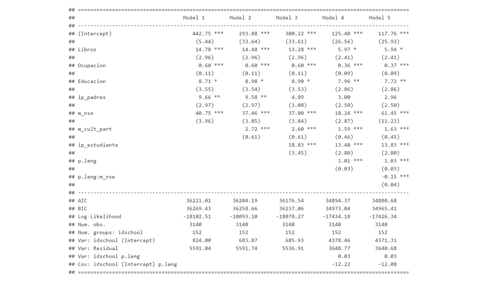
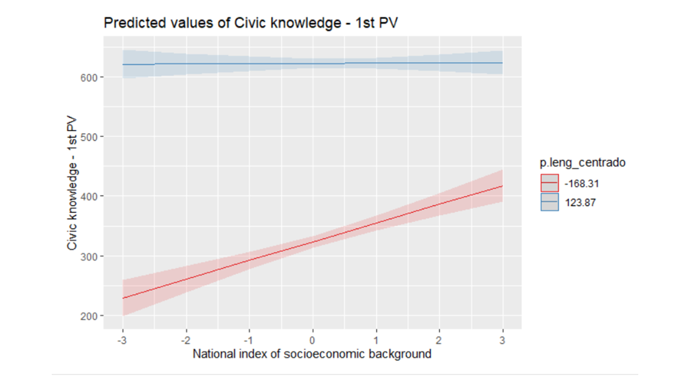
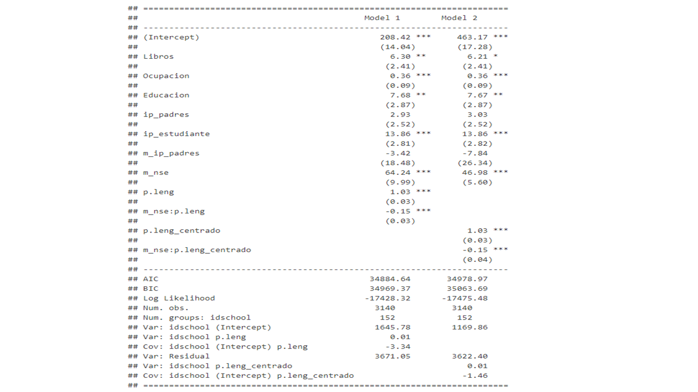

# Introducción.

La democracia chilena posee problemas de legitimidad que son claramente visibles en estos días de estallido social. Parte de lesa deslegitimidad se relaciona con la falta de participación de los distintos grupos sociales en la política, lo que deviene en una desigual representaciones de las necesidades y demandas de la población. Más aún, podemos hablar de una transmisión intergeneracional de la desigualdad política, es decir que quienes poseen más recursos poseen además ventajas políticas que transmiten a sus hijos. Esta tesis, que posee como horizonte normativo mejorar la 
 desigual participación democrática, propone que lo que explica dicha reproducción es, en alguna medida, la distribución desigual del manejo del lenguaje y que este es también una de las soluciones necesarias para mejorar el problema.

Al respecto internacionalmente se ha desarrollado una encuesta para producir información sobre las habilidades y conocimientos cívicos y ciudadanos de los estudiantes, con muestras que permiten hablar  de manera representativa de los colegios de cada país.  La información producida a partir de esta encuesta señala la existencia de un sesgo socioeconómico en la distribución del conocimiento cívico, así como una mayor disposición a participar de los grupos acomodados (Miranda, 2018, Agencia de Calidad de la Educación, 2017; Schulz, 2011; Castillo, Miranda, Bonhmme, Cox & Bascopé, 2015; Diazgranados & Sandoval-Hernández, 2017; Treviño, Béjares, Villalobos & Naranjo, 2017). Frente a estas evaluaciones reproduccionistas, algunos autores han destacado el papel que juegan variables del aula como lo son un contexto de valores democráticos,  la apertura a la discusión y participación (Duek, 2010; Schulz, Ainley, Fraillon, Kerr & Losito, 2010). Si bien estos aportes en la línea de la socialización son fundamentales, también es importante reconocer que el poseer padres con mejor educación y mayores recursos, también influye  en términos cognitivos, dado que existe alguna transmisión mediante la socialización primaria. Por ello, no controlar por las habilidades y destrezas académicas de los estudiantes es un error que podría llevar a subestimar el efecto de la transmisión intergeneracional de valores y actitudes hacia la participación. En suma, consideramos fundamental controlar el efecto del estatus socioeconómico de la familia y del ambiente cultural de la escuela en el conocimiento cívico, por las habilidades de comprensión lectora que conllevan la capacidad de entender enunciados y analizar discursos. Así, y siguiendo la importancia de dichas habilidades, planteamos la posibilidad de que personas de escasos recursos con buenas habilidades lectores logren  buenos niveles de conocimiento cívico.  

En suma, las preguntas de investigación  que guían esta tesis son las siguientes: 

	1. ¿En qué medida manejo del lenguaje explica la relación entre conocimiento cívico y nivel socioeconómico?
	2. ¿Es capaz la comprensión de resolver la desigualdad  social del conocimiento cívicos? 

# Desarrollo

## Los problemas de la democracia y la esperanza en la educación. 

La democracia chilena, como muchas otras, posee varios defectos, de los cuales nos concentramos en dos. Primero, es una democracia que posee una baja participación, lo cual socava y pone en riesgo la validez del sistema democrático (Janmaat, 2013; Contreras & Navia, 2010; Browne & Elming, 2015; Miranda, Castillo & Sandoval-Hernández, 2015). Segundo, es una democracia que está sesgada socioeconómicamente, teniendo mayor participación grupos más acomodados, y siendo excluidos grupos desfavorecidos, según informan los resultados dela encuesta longitudinal ELSOC (Bargsted, Somma, Joigted, Campos  & Joignant, 2017).

Esta falta de participación de los estratos bajos, es reforzada por la existencia de una transmisión intergeneracional de la desigualdad política. A nivel internacional, existen múltiples evidencias que señalan la existencia de de dicha transmisión (Miranda, 2017, Amnå et al., 2009; Brady et al., 2015; Quintelier & Hooghe, 2013; Wasburn & Covert, 2017;Castillo, Miranda, Bonhomme, Cox, & Bascopé, 2014; Schlozman et al., 2012; Sidney Verba et al., 2003). Al respecto,  Daniel Miranda (2018) destaca el papel que juega la transmisión del conocimiento cívico a nivel intergeneracional. 

En torno a dicha transmisión cabe la pregunta  ¿de qué manera se transmite ese conocimiento cívico? Al respecto la teoría señala, que el mayor tiempo disponible de los hogares acomodados, junto a un mayor conocimiento de temas políticos, les permite socializar a sus hijos en ambientes de discusión, que fomentan el interés y la participación política (Gimpel, Lay, & Schuknecht, 2003; Brady et al., 2015; McDevitt & Chaffee, 2002; Sidney Verba et al., 2003; Wasburn & Covert, 2017). Dicho de este modo, podríamos decir que la transmisión social de la desigualdad política es un tema de intereses, o como planteó Bourdieu, un tema de habitus (1979). Si bien estos son aportes fundamentales, es importante destacar que consideran de manera parcial el efecto de  distribución desigual de habilidades académicas como la lectura.

En consideración de todos estos problemas de participación, el Estado Chileno ha decidido incorporar como una asignatura la materia de Educación Cívica, a la vez que se incorporan objetivos democráticos que deben ser promovidos durante toda la enseñanza escolar (Mineduc, 2016). Así, esta modificación a la ley N° 20.911, que crea el plan de formación ciudadana, tiene como objetivo general: 

>“la preparación necesaria para asumir una vida responsable en una sociedad libre y de orientación hacia el mejoramiento integral de la persona humana, como fundamento del sistema democrático, la justicia social y el progreso” con “formación de ciudadanos, con valores y conocimientos para fomentar el desarrollo del país, con una visión del mundo centrada en el ser humano, como parte de un entorno natural y social”. 

Además de este objetivo fundamental promovido por el Estado, la Educación Cívica posee los siguientes objetivos: 

1. Promover la comprensión y análisis del concepto de ciudadanía y los derechos y deberes asociados a ella en una sociedad democrática.

2. Fomentar en los estudiantes el ejercicio de una ciudadanía crítica, responsable, respetuosa, abierta y creativa.

3. Promover el conocimiento, comprensión y análisis del Estado de Derecho y de la institucionalidad local, regional y nacional.

4. Promover el conocimiento, comprensión y compromiso de los estudiantes con los derechos humanos, con especial énfasis en los derechos del niño.

5. Fomentar en los estudiantes la valoración de la diversidad social y cultural del país.

6. Fomentar la participación de los estudiantes en temas de interés público.

7. Garantizar el desarrollo de una cultura democrática y ética en la escuela.

8. Fomentar una cultura de la transparencia y la probidad.

9. Fomentar en los estudiantes la tolerancia y el pluralismo.

Así como puede verse la ley posee la esperanza de influir en este problema mediante la educación. Ivica. Se ha decidido que el colegio es un espacio apto para resolver parte del problema y avanzar a una cultura más democrática. No obstante, pese a las advertencias de la evidencia, no se señalan mayores alusiones a la desigualdad de capacidades e intereses políticos que existen a nivel socioeconómico. Esta omisión en la formulación podría derivar en problemas de la implementación de la política. Es por ello que estudiar en las condiciones en las cuales se realizará la política nos permite evaluar qué problemas podría afrontar. Dentro de esas dificultades la denominada reproducción de la desigualdad política debe ser prioritariamente estudiada, para evaluar mediante qué mecanismos opera. 

# Conceptos fundamentales: El conocimiento cívico, definición y antecedentes 

El conocimiento cívico y ciudadano (i.e. habilidades y conocimientos necesarios para la vida ciudadana) es actualmente promovido por diversos agentes a nivel académico, estatal e internacional. Este conocimiento es sumamente relevante si se considera sus efectos positivos sobre la intención de participación, en un contexto de apatía política y baja participación de estratos bajos y jóvenes (Janmaat, 2013; Contreras & Navia, 2010; Browne & Elming, 2015; Miranda, Castillo & Sandoval-Hernández, 2015). Igualmente, en el contexto de los nuevos movimientos sociales que buscan reivindicar los derechos de distintos grupos tradicionalmente discriminados, el conocimiento cívico ha demostrado estar relacionado con el respeto a los derechos humanos de estos grupos (Miranda, Castillo & Cumsille, 2018; Caro, Schulz, 2012). También, el tener más conocimiento cívico se relaciona con estar en desacuerdo con la corrupción y con la valoración positiva de la democracia como sistema representativo, lo cual, según Hastedt (2016), es fundamental en un contexto de resurgimiento de los gobiernos autoritarios. En suma, el conocimiento cívico puede ayudar a las personas a incorporar los principios democráticos de los derechos humanos y, por ello, debe buscarse las maneras de fomentar y hacer más útiles las políticas que buscan incorporarlo como ramo dentro de la educación secundaria.

Las investigaciones actuales han propuesto que el conocimiento cívico es especialmente influido por variables de origen socioeconómico (Agencia de Calidad de la Educación, 2017; Schulz, 2011; Castillo, Miranda, Bonhmme, Cox & Bascopé, 2015; Diazgranados & Sandoval-Hernández, 2017; Treviño, Béjares, Villalobos & Naranjo, 2017), dando cuenta de lo que se denominará desde este punto, la “Desigualdad social del conocimiento cívico”, sin embargo, no han controlado dicho efecto en función de las capacidades académicas, lo cual puede generar errores de sobrestimación del efecto. Proponer el origen socioeconómico como factor fundamental para explicar el conocimiento cívico, podría llevar a pensar en alguna medida, que este es transmisible de manera intergeneracional a través de la socialización familiar. Explicarlo de dicho modo sería ignorar que al igual que otras materias, el conocimiento cívico es un conjunto de conocimientos y habilidades que se adquieren a partir de procesos cognitivos de aprendizaje escolar, y que dependen por ello, del desarrollo cognitivo anterior del estudiante y de motivación por la asignatura para ser incorporado. Podría discutirse a lo anterior, que bien los padres pueden enseñar conocimientos del sistema político a sus hijos, pero para probar esta idea, sería necesario controlar por el desempeño académico de los estudiantes, para no confundir la transmisión de conocimientos con transmisión de habilidades académicas. Aún más, en función de esta reflexión, puede criticarse que parte de la relación entre conocimiento cívico y origen socioeconómico es parcialmente espuria y se debe más bien a la influencia del origen socioeconómico en la comprensión lectora. Esta propuesta no niega en ni un sentido que existe la desigualdad social del conocimiento cívico, sino que más bien, propone que esta se explica, por la influencia del nivel socioeconómico en el rendimiento académico y en el interés sobre las materias políticas y sociales.

Así, se hipotetiza que el el manejo del lenguaje explica la relación entre el origen socioeconómico y el conocimiento cívico, en consideración de tres argumentos.
 
En primer lugar, puede suponerse que existe una relación entre el conocimiento cívico y el rendimiento académico, dado que ambas variables son afectadas por el estatus y el capital cultural de los padres de manera coherente. Desde los planteamientos de la línea de la reproducción cultural (Bonal, 1998) de Bourdieu, Passeron y de Bernstein, se plantea que los hijos de sectores más acomodados y con más recursos educativos, tendrán más ventajas en el sistema educativo, ya sea porque incorporan pautas de lenguaje más complejas, como plantea Bernstein (1977), o porque poseerán mayor interés por el aprendizaje, mejores capacidades y mayor concordancia de hábitos con el colegio (Bourdieu, 1979; Vargas-Salfate, Oyanedel & Torres-Vallejos, 2014; Dukuen, 2015), así como por el acceso a mejores establecimientos educativos. En coherencia con estos planteamientos y más contextualizado al caso chileno, Dante Contreras (2012), investigador principal del proyecto FONIDE N°: FE11139, concluye que el capital cultural de los padres, puntualmente el capital objetivado y el incorporado, poseen un efecto positivo sobre los resultados de los alumnos chilenos en la prueba PISA. Por su parte, y como ya se ha señalado, el conocimiento cívico es influenciado por las mismas variables, como la cantidad de libros que se posee en el hogar. En función de que tanto el conocimiento cívico como el rendimiento académico son influidos por el capital cultural, es posible hipotetizar que existe una relación entre ambas variables.
 
En segundo lugar, es posible hipotetizar una relación entre rendimiento académico y conocimiento cívico ya que ambos requieren un conjunto de habilidades y destrezas semejantes (i.e. conocimientos, aplicación y razonamiento). Según el informe de la Agencia de la Calidad de la Educación del MINEDUC (2016) el conocimiento cívico mide dos dominios cognitivos, los conocimientos y el razonamiento-análisis (Schulz, Ainley, Fraillon, Losito y Agrusti, 2016). Por su parte la prueba SIMCE evalúa los contenidos relativos a las Bases Curriculares (Mineduc, 2015), según las cuales se establecen tres habilidades a evaluar dentro de la prueba de lenguaje en las pruebas de Lenguaje, Matemáticas y Ciencias, los cuales son Conocimientos, Aplicación y Razonamiento. Si bien son tres habilidades en vez de dos, como en el caso de la prueba del conocimiento cívico, si se mira con detalle a que refiere “razonamiento y análisis” podemos dar cuenta de que involucra la Aplicación de los conocimientos cívicos a situaciones más amplias, así como el razonamiento para evaluar propuestas de soluciones, dando cuenta de que se encuentran presentes las dimensiones de aplicación y razonamiento en la prueba de la ICCS. Cabe agregar, que las tres pruebas de SIMCE exigen ser capaz de analizar información para generar deducciones u opiniones justificadas. Incluso José Valenzuela (2015) plantea que todas las pruebas SIMCE, requieren de la habilidad de análisis de información, habilidad igualmente necesaria para la prueba de la ICCS. En suma, podemos ver que existen múltiples incongruencias respecto a las habilidades necesarias para responder la prueba de lenguaje en relación a la prueba de conocimiento cívico. 
 
En tercer lugar, centrándonos en la comprensión lectora dentro del rendimiento académico, puede argumentarse que esta, como expresión del manejo del lenguaje, es fundamental en el proceso de incorporación del mundo político (Nie, Junn, Stehlik-Barry 1996; Álvarez, 2003), por lo cual se espera que haya una relación especialmente fuerte entre el resultado de la prueba de lenguaje y la prueba de conocimiento cívico. Esta afirmación es igualmente respaldada por la relación recurrente que existe entre Educación y capacidades para incorporar el mundo político  (Lipset, 1960). 
 
 
Por su parte, es razonable hipotetizar que el interés por la política y las temáticas sociales puede explicar la relación entre conocimiento cívico y capital cultural de los padres, si se considera, primero, que el capital de los padres tiene un efecto sobre el interés por la política y participación (Kriger y Dukuen 2012), y segundo que el interés y la motivación son fundamentales en el proceso de aprendizaje en distintas áreas (Carrillo, Padilla, Rosero y Villagómez, 2009; Lozano, García-Cueto y Gallo, 2000; Mateos, Bejarano, Ezquerro y López-Fernández, s.f.). Además, según lo señalado por Schulz (2016), los espacios para discusiones sobre temas políticos y sociales tienen una capacidad predictiva sobre el conocimiento cívico de los estudiantes. En relación a lo que plantea el autor y considerando la importancia de la motivación por la materia en el aprendizaje, puede pensarse que parte del efecto de estos espacios de discusión es que motivan a los estudiantes sobre la materia, lo cual cobra sentido si se considera que las clases participativas de aprendizaje cooperativo tienen un efecto sobre la motivación de los estudiantes (Méndez, 2015).
 
En suma, el objetivo de este trabajo puede ser expresado en la siguiente pregunta
¿En qué medida el rendimiento académico en lenguaje y el interés político son capaces de explicar la desigualdad social del conocimiento cívico según?

Conocimiento cívico y ciudadano, es entendido como conjunto de saberes y habilidades que son necesarios para la vida en ciudadanía (ICCS, 2016). En términos de habilidades el conocimiento cívico requiere de la habilidad de reflexionar a partir de información y conceptos, así como de poder tener una opinión crítica y poder evaluar propuestas. En términos de contenidos, los saberes propios de este constructo se definen en la tabla 1. La bibliografía ha señalado hasta ahora que el conocimiento cínico es influenciado por variables socioeconómicas. Se ha demostrado igualmente que este efecto es más producido por la educación y el número de Libros en el lugar que por la ocupación, dando luces respecto al carácter cultural del fenómeno (e.g. Castillo, Miranda, Bonhomme, Cox & Bascopé, 2014), a lo cual agregan variables agrupadas a nivel escuela como el nivel socioeconómico promedio de la escuela. Por otro lado, otros autores han explorado el efecto de variables de la escuela sobre el conocimiento cinco a partir de las cuales se puede decir que un clima más abierto a la discusión y una cultura participativa a nivel escuela son propicios para el conocimiento cívico (Schulz, 2016). Estas son variables fundamentales se incluyen como controles para nuestro trabajo.

Por desigualdad social del conocimiento cívico este artículo se refiere a la relación positiva que existente entre el conocimiento cívico recién definido y el origen socioeconómico. Por origen socioeconómico, se entiende la relación entre el estatus ocupacional, el nivel educativo alcanzado, y la cantidad de libros en el hogar (ICCS, 2016; Mineduc, 2016). Esta variable es bastante semejante al estatus socioeconómico (SES), solo que la variable origen socioeconómico de la ICCS, no incorpora los ingresos, como usualmente lo hace el SES (Burgard y Stewart, 2003) e incorpora además la cantidad de libros. El que no se incorporen los ingresos es sopesado por incorporar ocupación, que es un mejor indicador de ingresos a largo plazo que la información de ingresos recopilada en cualquier momento dado, porque a corto plazo, los ingresos pueden ser bastante volátiles (Williams y Collins 1995).
Siguiendo con la desigualdad social del conocimiento cívico, se podría afirmar, que esta es parte de un proceso más amplio de desigualdad sociocultural de la política, sobre la cual Bryony Hoskinsa, Jan Germen Janmaat, Christine Han y Daniel Muijs (2016) realizan muy buenas observaciones. A partir de datos mixtos, en distintos países de Europa, los autores dan cuenta como un menor nivel socioeconómico se relaciona con un peor desempeño académico, lo que lleva a las personas a tener una auto-evaluación general deficientes de si mismos, y por ello, una baja autoeficacia política, la cual se relaciona igualmente con baja intención de voto. Podría decirse que esta investigación sigue una lógica semejante a la de los autores, agregando a la baja autoeficacia, las dificultades que implica tener una baja capacidad de aprendizaje y mal desarrollo de habilidades en la incorporación de conocimientos y destrezas necesarias para la vida cívica y ciudadana.
 
El rendimiento académico en lenguaje será considerado como medida de las capacidades del alumno, que expresa lo que éste ha aprendido a lo largo del proceso formativo (EcuRed, 2019). Para trabajar con esta variable se utilizará la prueba SIMCE, la cual, justamente busca medir los logros de aprendizaje de los estudiantes chilenos (Mineduc, 2019). Según Barahona (2014) Existe un consenso en que los factores asociados al desempeño académico pueden tener su origen en dos grandes ámbitos: en los determinantes personales y en los determinantes sociales, aunque este consenso puede ser interpelado por Lara, Mizala & Repetto, 2010, quienes demuestran el efecto que pueden tener las prácticas docentes, sugiriendo, entre otras cosas, que discutir la materia en clases es positivo para el rendimiento, resultados coherentes con los resultados presentados por Schulz (2016), según quien, en 17 países un clima abierto a la discusión en el aula es un buen predictor de rendimiento en conocimiento cívico. Ahora bien, si se reconsidera lo planteado por Méndez (2015), quien da cuenta de que metodologías participativas generan un efecto positivo en la motivación por la asignatura y que el interés por la misma es fundamental en el aprendizaje (Carrillo, Padilla, Rosero y Villagómez, 2009; Lozano, García-Cueto y Gallo, 2000; Mateos, Bejarano, Ezquerro y López-Fernández, s.f.), podemos pensar que parte del efecto del clima participativo pasa por el interés de los estudiantes sobre temas de política y sociedad. Para este trabajo incluiremos sólo el interés por la política.
Datos, variables y metodología.

Para trabajar esta propuesta se utilizó la base de datos internacional ICCS 2016, la cual fue cruzada con los resultados de la prueba SIMCE nacional chilena. Se obtuvo un total de 3140 casos, si se eliminan los perdidos de todas las variables utilizadas. Las variables que se utilizaron fueron el conocimiento cívico, en su primera estimación (PV1CIV), el origen socioeconómico nacional estandarizado (S_NISB)  con el cual se construyó el promedio del nivel socioeconómico de la escuela, la educación y ocupación más alta de los padres, la cantidad de libros en el hogar, el interés político del estudiante y de los padres (S_SINT, S_HINT). También incorporamos una variable que representa la cultura democrática, la cual está construida a partir del promedio de la actitud de los estudiantes respecto a la participación. Además se utilizamos el puntaje en la prueba de comprension lectora Simce. 

# Método

Para abordar la problemática se trabajara con la base de datos de la encuesta internacional de conocimiento cívico (ICCS) en su tercera versión del 2016. Además contamos con los datos de la prueba simce para los mismos estudiantes lo que nos permite evaluar la relación entre comprensión lectora y conocimiento cívico. Se trabajó por ende con una base de 3140 estudiantes representativos a nivel nacional. En consideración de dicho tamaño muestral, se utilizará un 99% de nivel  de confianza. 
Para poder probar nuestras hipótesis de manera correcta se trabajó con regresiones Multinivel, en las cuales se ha dejado de pendiente aleatoria el efecto del lenguaje y se han producido interacciones con variables de segundo nivel como el promedio del nivel socioeconómico del colegio. 

# Resultados. 

	En la tabla consecutiva se presentan 4 modelos multinivel los cuales son todos significativamente mejores que el anterior. El primer modelo incluye las variables de reproducción social, el segundo, incluye una variable de la escuela, el tercero agrega el interés político social del estudiante. El cuarto incluye la variable puntaje en la prueba simce de lenguaje, y el quinto expone la aleatorización de la pendiente y la interacción  de una variable nivel dos: el promedio del nivel socioeconómico. 

### Tabla 1 

El primer modelo incluye aquellas variables que representan la reproducción social de la desigualdad política, y como puede verse, todas estas variables poseen un efecto significativo que implica cambios de puntajes que van aproximadamente 10 a 40 puntos. Así, poseer más de 100 libros en la casa, aumenta 14  puntos el conocimiento cívico, por su parte  la variable ocupación posee un efecto considerable, en un rango de más de 80 valores, por cada unidad que aumenta el índice de estatus ocupacional el estudiante aumentó 0.6 puntos en la prueba de conocimiento cívico, así por ejemplo poseer 50 pts. más  de estatus ocupacional implica aumentar 30 pts. en la prueba de conocimiento cívico. Respecto al efecto de la educación de los padres, este es ambivalente, puesto que si bien es respaldado por la literatura, en vista de los controles aplicados parece solo tener un efecto significativo con un 90% de confianza, criterio demasiado laxo para una muestra de más de 3000 casos. En último lugar, considerando la variable de segundo nivel, promedio del nivel socioeconómico de los padres del colegio, podemos decir que existe un gran peso del contexto socioeconómico del colegio.

El segundo modelo incorpora una variable del contexto educativo, esta variable da cuenta de que tan de acuerdo están los estudiantes en general con que la participación en la escuela y la comunidad son beneficiosos para la comunidad. Como puede verse, por cada punto que aumenta este promedio mejora en 2 puntos el conocimiento cívico, lo cual reafirma la hipótesis de que un contexto de participación es útil para mejorar el conocimiento cívico de los estudiantes. Cabe destacar que el incorporar esta variable no logra controlar las variables de origen familiar, lo que nos da cuenta que las ventajas sociales del conocimiento cívico no pasan por estar en colegios con mejores climas democráticos. 

El Tercer modelo incorpora la variable interés político del estudiante. Como plantea la teoría, un estudiante que posee intereses sobre una materia posee una ventaja respecto a la misma, premisa que es comprobada en este caso. El que un estudiante posea interés en la política y los asuntos sociales se asocia con tener 19 puntos más en la prueba de conocimiento cívico. Resulta interesante que el efecto de poseer padres interesados por la política, es completamente controlado por el efecto de que el estudiante tenga interés, lo que nos da cuenta de que el efecto de los padres pasa a través de los hijos. Este control nos permite decir que el efecto del nivel socioeconómico y las ventajas en términos de capital cultural no se explican completa, ni medianamente por qué las personas de mayores recursos tengan más intereses en la política, lo cual nos permite desde ya poner en duda las  explicaciones que aluden a que el conocimiento cívico es transmitido como valores e intereses de generacion en generacion. Siendo más específicos, el efecto que más es controlados es el de tener libros en la casa. Al parecer, el tener libros en la casa se relaciona con estudiantes interesados en la política, que obtuvieron mejores puntajes en esta prueba. 

El cuarto modelo modelo es el modelo fundamental de este trabajo. En este modelo las demás variables son controladas por el efecto de la comprensión lectora medida en la prueba simce de lenguaje. Como puede verse  cada punto que aumenta alguien en la prueba simce de lenguaje, aumenta 1 punto en la prueba de conocimiento cívico, lo cual es una relación bastante estrecha considerando los rangos de ambas pruebas.  Lo más interesante de incorporar esta variable es lo que ocurre con las demás. Como puede verse el efecto de que existan más de 100 libros en el hogar, prácticamente desaparece, pasando de un efecto de 13 a 6 puntos, y perdiendo la significación al 99%. Por su parte, respecto a la variable de estatus ocupacional de los padres y al nivel socioeconómico promedio del colegio, es bastante sugerente el hecho de que ambos efectos disminuyen casi a la mitad. En vista de estos controles, podemos decir que el efecto de que los padres posean libros en la casa es realmente producido por la influencia que eso ejerce en la comprensión lectora de los estudiantes. Igualmente, podemos decir que casi la mitad del efecto del nivel socioeconómico de los padres en el conocimiento cívico se debe a la influencia de estas posiciones en el buen manejo del lenguaje. 

El quinto modelo es un poco más complejo. Primero incorpora la aleatorización de la pendiente del efecto de la comprensión lectora sobre el conocimiento cívico, permitiendo que esta varíe según contextos. Luego, intentamos explicar dicha variación de la pendiente en función del nivel socioeconómico del colegio, para ver si el efecto del lenguaje sobre el conocimiento cívico difiere en contextos socioeconómicos distintos. Como puede verse en la tabla, el efecto es significativo, y mientras mayor es el nivel socioeconómico menos importante es la comprensión lectora, como puede verse en el gráfico

### Gráfico 1. 

	Como puede verse en el gráfico, la pendiente de la relación es muy distinta si se posee un alto o un bajo nivel socioeconómico promedio de la escuela. En escuelas con un bajo nivel socioeconómico (línea roja), la pendiente es mucho más pronunciada y el intercepto es mucho menor. Dicho de otra manera, en las escuelas con un nse promedio bajo, la comprensión lectora es más determinante respecto al conocimiento cívico, así, quienes no poseen una buena comprensión lectora siendo establecimientos vulnerables, alcanzan 300 puntos en al prueba de conocimiento cívico, mientras que quienes están en una escuela con padres de alto estatus y poseen una pésima comprensión lectora, alcanzan 450 puntos en dicha prueba. Esto, nos permite afirmar que en contextos vulnerables es aún más importante promover el manejo del lenguaje. 
	
	Observando el gráfico anterior, llama la atención que en puntajes muy altos de comprensión lectora, no importa el contexto económico del colegio del estudiante. Este punto del gráfico incita a pensar que si estudiantes de contextos vulnerables alcanzan una buena comprensión lectora podrán desarrollar de buena manera las habilidades y conocimientos que son necesarios para la vida ciudadana. Para evaluar esta posibilidad, invertimos el orden del gráfico, evaluando en qué medida un buen puntaje en el lenguaje puede moderar la relación entre estar en un contexto escolar vulnerable y tener un deficiente conocimiento cívico. En el gráfico 2 se evalúa dicha interacción.  
	
	

### Gráfico 2

En este gráfico podemos evaluar como el efecto del nivel socioeconómico de la escuela es moderado de manera casi perfecta por la comprensión lectora. Como puede verse, si un estudiante posee un excelente puntaje en la prueba de comprension lectora simce, independiente del nivel socioeconómico de su escuela, tendrá un muy alto puntaje en conocimiento cívico. 

Hasta este punto, cabe la duda de si todo este efecto de la comprensión lectora es efectivamente propio, o es más bien un reflejo de algún efecto del colegio. Para evaluar que esto no esté ocurriendo, replicamos el último modelo centrando la variable comprensión lectora por el promedio de cada grupo, con el objetivo de despejar aquella varianza que corresponde al nivel escuela. Los resultados se exponen en la tabla número 2. 

### Tabla número 2.

A partir de la tabla número dos podemos decir que el efecto del lenguaje se mantiene independiente del centrado. Además, el centrar las variables no vuelve significativas al 99% las variables de origen socioeconómico que pierden su peso al incorporarse el lenguaje, lo que nos indica que efectivamente el manejo individual del lenguaje es lo que produce el efecto señalado. 

# Conclusiones preliminares

Este trabajo abordo cuales son los mecanismos por los cuales se produce la reproducción intergeneracional de la desigualdad política. Al respecto se manejaban dos hipótesis, la primera alude a que la socialización en familias con recursos implica una mayor proximidad a discusiones y valores democráticos. La segunda, fue que tener una posición económica aventajada se relaciona con acceder a buena educación y ser socializado con un lenguaje complejo y por ello, implica un mejor manejo del lenguaje que facilita la asimilación del conocimiento cívico.

En función de los resultados, podemos decir que aquellas teorías que explicaban la relación entre nse y conocimiento cívico, por la transmisión de valores, si bien son ciertas, poseen una visión parcial de lo que ocurre ya que en buena medida la desigualdad social del conocimiento cívico se relaciona ampliamente con la desigualdad social de la comprensión lectora, la cual se relaciona con el capital cultural objetivado  de los padres (más de 100 libros en el hogar) y el acceder a buena educación, lo cual se relaciona a su vez con acceder a educación de buena calidad. Es decir, no es tanto que los padres adinerados eduquen democráticamente a sus hijos, sino que más bien, ya sea por transmisión directa o por acceso a buena educación, les otorgan un mayor manejo del lenguaje, lo cual les permite igualmente incorporar de manera más compleja la realidad política, teniendo más herramientas para comprender, analizar y criticar políticamente. 

Respecto a cuáles son los caminos que deben tomarse para mejorar la desigualdad en el conocimiento cívico y en la participación ciudadana, resulta evidente después de los resultados, que además de reforzar la educación cívica en los colegios como ya se está haciendo (y debe seguirse haciendo, debe fomentarse la comprensión lectora). Incluso podemos decir que cuando se posee altos niveles de comprensión lectora, las diferencias de estatus socioeconómico no afectan de manera sustancial, existiendo estudiantes de colegios con bajo nivel económico que poseen una buena comprension lectora y civica.
 Al respecto, tipos de clases que impliquen lectura colectiva y discusión sobre lo leído, para entender en conjunto el sentido de los textos, puede ser una muy buena estrategia, puesto que está demostrado que los profesores que realizan dichas actividades mejoran el puntaje en lenguaje de sus estudiantes (Lorena Ortega)  así como que aulas más participativas poseen un efecto para la el conocimiento cívico. Es en dichos espacios de participación donde puede sacarse el provecho al capital cultural de cada estudiante y fomentar el efecto pares. 

En relación al nuevo plan de formación ciudadana, y considerando estos resultados es sensato esperar un efecto diferencial de la política en cada establecimiento según el nivel de comprensión lectora del colegio, lo cual está relacionado con el nivel socioeconómico. Quizás sea prudente en miras del objetivo de la política, prestar ayuda especializada a colegios que posean bajos niveles de comprensión lectora. También, dentro de los colegios prestar apoyo a los estudiantes con dificultades al respecto también puede ser una buena medida a aplicar en cursos anteriores al último ciclo de tercero cuarto, donde debersn aplicar dichas habilidades en la reflexion ciudadana y en la incorporacion de conocimientos civicos. 

